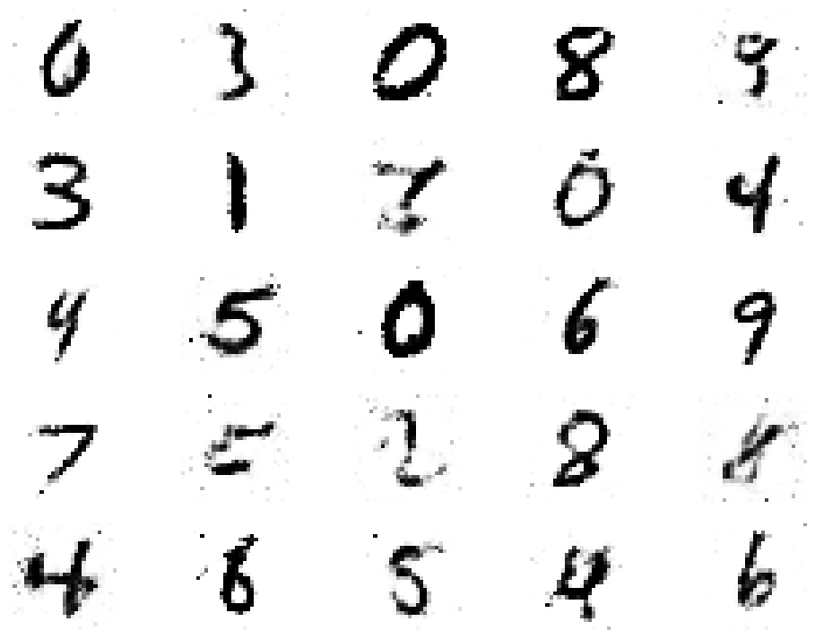

# GAN-Hand-Writting-Digit-Generator
Basic GAN project to generate images of hand writting digit

## Environments and Dependencies
Python 3.10.6

Install requirements
```bash
pip install -r requirements.txt
```

## Dataset
MNIST dataset was used for this project can be found [here.](http://yann.lecun.com/exdb/mnist/)

## Inference
Simply run
```bash
python infer.py
```
Some results from inference are as shown:
